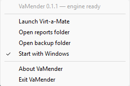
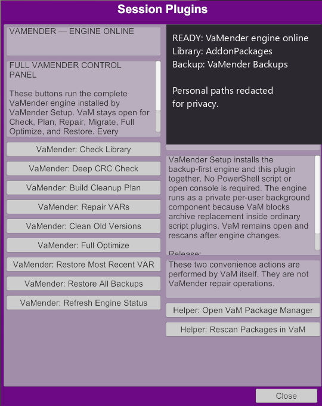
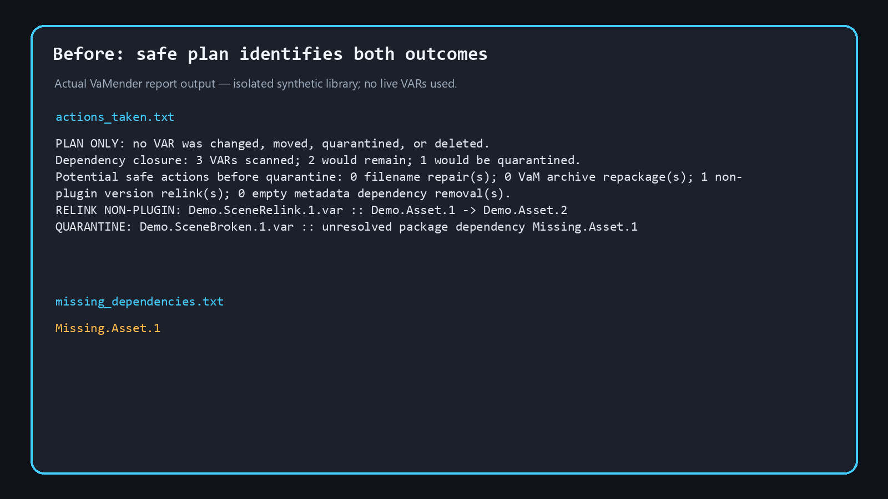
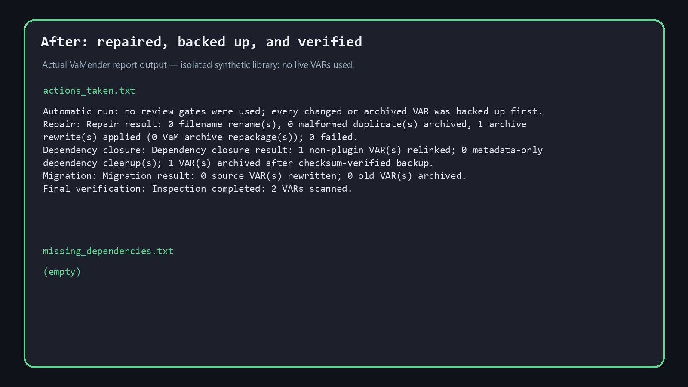

<!-- SPDX-License-Identifier: MIT -->

<p align="center">
  
</p>

# VaMender

[](https://github.com/TheAgenticCreator/vamender/actions/workflows/ci.yml)
[](https://github.com/TheAgenticCreator/vamender/actions/workflows/codeql.yml)
[](LICENSE)
[](https://creativecommons.org/licenses/by/4.0/)

VaMender is a fast, backup-first VAR repair and dependency cleanup tool for
Virt-a-Mate. It reconciles the full `AddonPackages` graph with VaM's own
package-rescan log, repairs high-confidence metadata problems, relinks safe
non-plugin references, conservatively retires old versions, and isolates
content that cannot run with the installed library.

VaMender is designed around one rule: **prove the replacement and preserve the
original before changing a live VAR**.

> [!IMPORTANT]
> **Release channel: beta.** VaMender is engineered to production-grade safety
> and release gates, but current builds remain beta while supported-environment
> installer, in-VaM, mutation, restore, and uninstall evidence accumulates. The
> evidence-based promotion gates are defined in [the v1.0.0 roadmap](docs/ROADMAP.md).

## Why VaMender exists

I built VaMender after repeatedly trying to reach a state that VaM itself
acknowledged as clean. Installing one reported dependency could introduce its
own missing subdependencies, so the apparent fix produced more missing-package
errors—the familiar dependency-hell rabbit hole. VaMender's primary purpose is
to evaluate the complete installed dependency graph together with a fresh VaM
rescan, then repeat the repair and closure process until VaM agrees with the
result. That approach gave me a fully clean `AddonPackages` library for the
first time.

[Sharp VaM Tools](https://f95zone.to/threads/sharpvamtools-v3-boss963.241571/)
is a fantastic companion and is highly recommended for the many targeted
cleanups and other useful operations that VaMender deliberately cannot touch.
[Qvaro](https://hub.virtamate.com/resources/qvaro.58130/) is another excellent,
very fast, and well-made tool that is highly recommended for a less complex
workflow and its comfortable UI/UX—even for experienced users. There are other
good VAR managers as well; VaMender is focused on this VaM-acknowledged
dependency-closure problem, not on replacing the ecosystem. If you develop or
maintain a VAR manager, please try VaMender, incorporate the parts that help
your users, and contribute ideas or improvements back to this project.

> [!CAUTION]
> **Never run a cleanup against your only copy of `AddonPackages`.** Keep an
> independent full backup on a separate location or drive. VaMender's verified
> per-VAR restore points reduce risk, but they are not a substitute for your
> own complete, tested backup. You are responsible for reviewing plans,
> choosing a safe backup destination, preserving access to paid/private
> content, and verifying the result in VaM.

## VaM compatibility

The Session Plugin has been tested with VaM `1.22.0.13` on Windows x64. VaM
`1.22.0.12` is expected to work because the plugin uses stable CLR 2, Session
Plugin, secure-file, and Unity UI surfaces, but that version has not been
directly tested. See [`docs/VAM-COMPATIBILITY.md`](docs/VAM-COMPATIBILITY.md)
for the exact compatibility basis and limits.

## Distribution

GitHub Releases is VaMender's only binary distribution channel. Download the
CI-built Setup executable, portable ZIP, VAR, and SHA-256 sidecars only from
[VaMender releases](https://github.com/TheAgenticCreator/vamender/releases).
Setup is the normal-user install path: it installs both the engine and the
bundled Session Plugin VAR. The standalone VAR is a CI-packaged/manual artifact,
not a replacement for Setup.
An F95Zone thread is an announcement and discussion page that links back to the
matching GitHub release; it must not host a separate binary or present a
download as a support link.

VaMender is not distributed through VaM Hub. Its moderators do not permit
third-party apps or scripts that modify VARs in `AddonPackages`, which is core
to VaMender's backup-first repair workflow. Do not upload or resubmit the VAR
to VaM Hub.

## Safety model

- VaMender can operate while VaM is open. The in-VaM control panel submits
  operations to the installed per-user engine and asks VaM to rescan its
  package registry after completion.
- The plugin itself remains inside VaM's sandbox and never opens archives
  directly. The engine performs every read or write, with the same verified
  backup and reporting rules as the normal CLI.
- Every rewritten or archived VAR is copied and SHA-256 verified first.
- All restore points are recorded in `manifest.jsonl`.
- Unknown licenses are never guessed.
- Script/plugin dependencies remain exact-version dependencies.
- Newer-version relinks are limited to non-plugin content with a local provider.
- Old versions are archived only after compatibility and post-rewrite checks.
- Stale VaM logs are ignored; locally provable references can still be handled.
- Paid, private, and authenticated content is never downloaded or bypassed.

## What it fixes

- Missing, invalid, stale, or incomplete `meta.json` dependency data
- Direct VAR references present in content but absent from metadata
- False dependencies caused by material, morph, and parameter labels
- Safe non-plugin references to newer compatible local package versions
- VaM-sensitive package-name casing mismatches
- Unicode creator and package identifiers
- ZIP central/local-header mismatches reported by VaM
- Malformed VAR filenames with unambiguous metadata-backed identities, including
  redundant download suffixes such as `_1` and `(1)`
- Byte-identical malformed filename duplicates, archived only after checksum
  verification and a whole-VAR backup
- VaM-confirmed references to internal files missing from an installed provider,
  with the deficient package identified for reacquisition
- Unusable dependency closures caused by genuinely absent packages
- Proven-safe duplicate and old package versions

VaMender does not invent a missing clothing item, silently substitute another
asset, or delete the scene that references it. Static archive analysis may find
dormant references that VaM never loads, so internal-member problems are only
called runtime-confirmed when they also appear in a fresh VaM log.

## Install

VaMender currently targets Windows, where Virt-a-Mate runs.

### Recommended: one-click Windows setup

The project-published beta Setup executable is recommended for nearly everyone.
GitHub Actions builds it only after governance, formatting, lint, tests, plugin
sandbox validation, and the Windows release build pass.

1. Download the newest beta `VaMender-Setup-<version>.exe` and its `.sha256`
   sidecar from [VaMender releases](https://github.com/TheAgenticCreator/vamender/releases).
2. Optionally verify the published SHA-256 checksum, then run Setup.
3. Select the folder containing `VaM.exe` and a durable backup folder outside
   `AddonPackages`.

See the [illustrated Windows Setup guide](docs/INSTALLATION.md) for every page.

Setup installs the engine, the VaM Session Plugin VAR, and a small VaMender
notification-area host. It requires no PowerShell script, terminal command,
administrator rights, or open console. The host starts with Windows by default
and keeps the real VaMender engine ready before, during, and after ordinary VaM
sessions. During an upgrade, Setup refuses to interrupt active or queued work,
stops an idle host before replacing its executable, checksum-verifies the new
plugin, and backs up and retires older VaMender plugin revisions.

Right-click the VaMender shield in the Windows notification area to:

- launch Virt-a-Mate;
- open VaMender reports or the configured backup folder;
- enable or disable **Start with Windows**;
- view VaMender version, compatibility, and safety information; or
- choose **Exit VaMender**. Exit stops accepting new work and waits for any
  active backup/repair operation to finish before shutting down safely.



Closing VaM does not close VaMender. This is intentional: VaM's plugin sandbox
cannot safely launch or supervise an external package-repair engine, and the
host must already be available when VaM starts. If you exit it accidentally,
choose **VaMender** from the Windows Start menu, or run
`%LOCALAPPDATA%\VaMender\vamender.exe`; the installed configuration starts the
tray host again. Re-enable **Start with Windows** from its tray menu if needed.

The release also provides `vamender-windows-x64.zip` for advanced portable CLI
use. Build from source only if you want to inspect, modify, or contribute to the
implementation.

## Use VaMender

Choose either the in-VaM Session Plugin or the standalone CLI. Both routes use
the same backup-first engine and report formats. The Session Plugin is the
recommended everyday route after running Setup; the portable CLI is intended
for detailed review, scripting, and troubleshooting.

### Route 1: VaM Session Plugin (recommended)

#### Load the plugin

1. Install VaMender with the project-published Setup executable. During Setup,
   select the folder containing `VaM.exe` and a durable backup folder outside
   `AddonPackages`.
2. Start VaM and open **Session Plugins**.
3. Select **Add Plugin**, then choose
   `AgenticCreator.VaMender.1:/Custom/Scripts/AgenticCreator/VaMender/VaMender.dll`.
4. Open the plugin's **Custom UI**. No scene or atom is required.
5. Confirm the status reads **VAMENDER — ENGINE ONLINE**. If it reads
   **ENGINE OFFLINE**, select **VaMender: Refresh Engine Status**. Repair or
   rerun Setup if it remains offline.
6. Optional: use **Session Plugin Presets > Change User Defaults > Set Current
   as User Defaults** to load VaMender whenever VaM starts.

Once loaded, open VaMender from Session Plugin Custom UI or from the themed
**Open VaMender** button beside **Open Default Scene**.



Personal filesystem paths are explicitly redacted in the documentation image;
the operation controls and status are genuine application output.

#### Run a safe first workflow

1. Keep an independent full backup of `AddonPackages`; do not rely only on
   VaMender's per-VAR backups.
2. Select **Helper: Rescan Packages in VaM** and let VaM finish its package
   scan.
3. Select **VaMender: Check Library**. Use **Deep CRC Check** when you also want
   every archive member read and CRC-validated; it takes longer.
4. Select **VaMender: Build Cleanup Plan** and review the completed status and
   report before choosing a mutation operation.
5. Choose only the operation you intend to apply. Unlike CLI `repair` and
   `migrate`, the plugin's mutation buttons apply changes immediately through
   the installed engine:

   | Plugin action | Behavior | Changes VARs |
   | --- | --- | --- |
   | **Check Library** | Inventories packages and unresolved dependencies | No |
   | **Deep CRC Check** | Performs Check plus a full archive-member CRC pass | No |
   | **Build Cleanup Plan** | Creates a VaM-log-aware proposed cleanup plan | No |
   | **Repair VARs** | Applies supported filename, metadata, and archive repairs | Yes |
   | **Clean Old Versions** | Applies conservative old-version migration | Yes |
   | **Full Optimize** | Runs repair, safe relinking, closure cleanup, and migration without another review gate | Yes |
   | **Restore Most Recent VAR** | Restores the newest manifest record | Yes |
   | **Restore All Backups** | Replays all records in the selected backup manifest | Yes |

6. Wait for **COMPLETE** or **FAILED**. VaMender disables competing operation
   buttons while a request is queued or running. Keep VaM open and do not start
   another VaMender operation during this time.
7. After a successful operation, VaMender asks VaM to rescan its package
   registry automatically. Review VaM's package results and the VaMender report
   before continuing.

Every plugin mutation uses the durable backup folder selected during Setup.
Each changed or archived VAR is copied and SHA-256 verified before replacement.
Plugin reports are stored under
`<VaM>\Saves\PluginData\VaMender\Bridge\reports\<request-id>` and contain the
same top-level `actions_taken.txt`, `actions_required.txt`, and
`missing_dependencies.txt` files as the CLI.

The following before/after images are rendered directly from VaMender's actual
report files for an isolated three-VAR synthetic library. No live library VARs
or private package names were used.





The **Open Package Manager** and **Rescan Packages in VaM** buttons are VaM
convenience helpers, not VaMender repair operations. Restore actions can replace
currently installed files; displaced files are preserved under
`restore-conflicts` rather than silently discarded.

The plugin is a precompiled CLR 2 assembly. It owns only the VaM-native UI,
operation requests, progress display, and rescan. The installed engine performs
the real dependency graph, archive, metadata, migration, and restore work.
VaM intentionally blocks ordinary plugins from writing `AddonPackages`,
launching executables, loading native libraries, or using unrestricted
`MVR.FileManagement`. A pure C# rewrite would still lack permission to apply
repairs. VaMender therefore uses a fixed operation allowlist and VaM's permitted
`Saves/PluginData` storage to communicate with the private per-user engine
installed by Setup.

This avoids unsupported junction tricks, native injection, and BepInEx-style
patching. It retains VaM's sandbox while giving the user a single integrated
control panel. The only VaM convenience actions retained are **Open Package
Manager** and **Rescan Packages**, clearly labeled as helpers rather than repair
operations.

Uninstall from Windows **Installed apps > VaMender**. Backups, reports, and the
installed VAR are intentionally retained. The portable ZIP remains available
for advanced CLI use and source-level troubleshooting, but most users should
use the project-published Setup executable.

### Route 2: standalone CLI

Download `vamender-windows-x64.zip` and its `.sha256` sidecar from
[VaMender releases](https://github.com/TheAgenticCreator/vamender/releases),
verify the checksum if desired, and extract the ZIP to a normal user-writable
folder. Open PowerShell in that folder and set paths for the executable,
library, durable backup, and reports:

```powershell
$tool = Join-Path $PWD "vamender.exe"
$vam = "D:\VaM\AddonPackages"
$backup = "E:\VaMender-Backups"
$reports = "D:\VaM\VaMVarReports"

& $tool --version
& $tool --help
```

Use this review-first sequence:

1. In VaM, run **Add-On Package Manager > Rescan Packages** and let the scan
   finish. VaM may remain open, but do not rescan or change packages in VaM
   while a CLI mutation is running.
2. Run the read-only inventory and plan. `--deep` is optional and slower.

   ```powershell
   & $tool check $vam --out "$reports\check"
   & $tool check $vam --deep --out "$reports\deep-check"
   & $tool plan $vam --out "$reports\plan"
   ```

3. Preview repair or migration without `--apply`. These commands are dry runs
   and do not require a backup path yet.

   ```powershell
   & $tool repair $vam --out "$reports\repair-preview"
   & $tool migrate $vam --out "$reports\migrate-preview"
   ```

4. Review `actions_taken.txt`, `actions_required.txt`, and
   `missing_dependencies.txt` in each report folder. Resolve any acquisition,
   rights, or missing-content actions through sources you are authorized to
   use.
5. To apply one reviewed stage, add both `--apply` and a durable `--backup`
   outside `AddonPackages`:

   ```powershell
   & $tool repair $vam --apply --backup $backup `
     --out "$reports\repair-applied"
   & $tool migrate $vam --apply --backup $backup `
     --out "$reports\migrate-applied"
   ```

   For the complete automatic workflow, `run` applies all supported stages
   without intermediate review gates. Use it only after reviewing a plan:

   ```powershell
   & $tool run $vam --backup $backup --out "$reports\full-run"
   ```

6. Start or return to VaM, run another package rescan, and review VaM's log and
   package status. The standalone CLI cannot trigger VaM's in-process rescan;
   that automatic rescan is specific to the Session Plugin route.

Restore from the backup manifest when necessary. Existing VARs are skipped by
default; `--overwrite` preserves displaced files under `restore-conflicts`.

```powershell
& $tool restore $vam "$backup\manifest.jsonl"
& $tool restore $vam "$backup\manifest.jsonl" --last 10
& $tool restore $vam "$backup\manifest.jsonl" --overwrite
```

The included `cleanup.ps1` wrapper performs the full automatic `run` workflow.
Use `comprehensive-cleanup.ps1` when you prefer review gates between repair and
migration stages.

### Optional: build from source

Build from source only when you want to inspect or modify the code, contribute
to the project, or produce your own build. Otherwise, use the GitHub Actions
release above. VaMender and VaM are Windows-only; official CI, CodeQL, tests,
packaging, and releases use GitHub-hosted Windows runners exclusively.

Install the [required build toolchain](https://www.rust-lang.org/tools/install),
then:

```powershell
git clone https://github.com/TheAgenticCreator/vamender.git
cd vamender
cargo build --release --locked
.\target\release\vamender.exe --help
```

The compiled executable is written to `target\release\vamender.exe`. Build the
native plugin against an installed VaM copy, then build the plugin VAR used by
Setup:

```powershell
.\tools\build-vam-plugin.ps1 -VaMPath "D:\VaM"
.\tools\package-vam-plugin.ps1 `
  -OutputPath .\dist\AgenticCreator.VaMender.1.var
```

The build script deliberately uses the .NET Framework 3.5 compiler because
VaM's Unity runtime loads CLR 2 (`mscorlib 2.0.0.0`) assemblies. It fails the
build unless `Assembly.GetTypes()`, `MVRScript` subtype discovery, and VaM's
sandbox metadata policy all pass against that installed VaM copy.

## Commands

| Command | Purpose | Changes VARs |
| --- | --- | --- |
| `check` | Inventory packages and unresolved dependencies; add `--deep` for full CRC validation | No |
| `plan` | Build a VaM-log-aware cleanup and quarantine plan | No |
| `repair` | Plan or apply safe metadata and archive-header repairs | With `--apply` |
| `migrate` | Plan or apply conservative old-version migration | With `--apply` |
| `run` | Apply the full safe workflow without review gates | Yes |
| `restore` | Restore checksum-verified VARs from a backup manifest | Yes |
| `support-report` | Create a local, review-first package diagnostic ZIP; add `--include-var-list` only with consent | No |

Run `vamender <command> --help` for complete options.

## Reports

Every command writes three predictable handoff files:

- `actions_taken.txt` — concise work completed
- `actions_required.txt` — blockers and the next user action
- `missing_dependencies.txt` — one unresolved package ID per line

The automatic `run` command keeps detailed stage reports under `_details/`
while preserving the same three-file top-level handoff.

### Privacy-first support report

Create a local diagnostic bundle after a fresh VaM package rescan:

```powershell
& $tool support-report $vam --vam-log "D:\VaM\output_log.txt"
```

VaMender extracts package-related identifiers without copying the complete VaM
log, absolute paths, VAR payloads, backup manifests, credentials, or private
URLs. Package names can still disclose paid/private content. Review
`README_FIRST.txt` and every generated file before attaching the ZIP to a
GitHub issue. A complete installed VAR list is excluded unless you explicitly
add `--include-var-list`.

To open the GitHub form after review, use both `--open-github` and
`--confirm-reviewed`. The browser handoff never uploads or attaches diagnostics;
submission remains a manual user action.

## Restore

VaM may remain open. Existing files are skipped unless `--overwrite` is
supplied. When overwriting, VaMender preserves the displaced file under
`restore-conflicts`.

```powershell
& $tool restore $vam "$backup\manifest.jsonl"
& $tool restore $vam "$backup\manifest.jsonl" --last 10
& $tool restore $vam "$backup\manifest.jsonl" --overwrite
```

Because a manifest can be cumulative, `--last N` is useful for undoing only
the most recent cleanup batch.

## Scope and limitations

VaMender does not attempt to repair arbitrary scripts, binary assets, artistic
content, or creator-specific behavior. It cannot prove that every newer
package is semantically interchangeable, so script migrations and changed
resource payloads stay blocked. Missing content must be acquired through VaM,
the Virt-a-Mate Hub, or another source you are authorized to use.

Repairing a VAR changes its bytes and checksum, which can affect Hub/version
identification. Preserve the creator's original package and never upload or
redistribute a modified third-party VAR. Restore or reacquire the original
before sharing a package or asking its creator for support.

VaM's package rescan remains the runtime authority step. When an engine
operation completes, the in-VaM control panel invokes VaM's public rescan
function automatically.

## Contributing

Fork the repository, create a focused branch, and open a pull request into
`main`. Required governance, formatting, lint, test, Windows build, and CodeQL
checks must pass before a change can be merged.

See [CONTRIBUTING.md](CONTRIBUTING.md), [MAINTAINERS.md](MAINTAINERS.md),
[SECURITY.md](SECURITY.md), [the beta-to-v1.0.0 roadmap](docs/ROADMAP.md),
[the GitHub and F95Zone release guide](docs/F95ZONE-RELEASE.md), and
[CHANGELOG.md](CHANGELOG.md) for project ownership, policies, release planning,
and history.

## License and disclaimer

VaMender's repository source code is available under the
[MIT License](LICENSE). The VaMender Session Plugin VAR is additionally distributed under
[CC BY 4.0](https://creativecommons.org/licenses/by/4.0/) and declares the
VaM-supported `CC BY` value in `meta.json`. Attribution should name
**AgenticCreator** and link to
`https://github.com/TheAgenticCreator/vamender`.

VaMender is an independent community project. It is not affiliated with or
endorsed by Meshed VR, Virt-a-Mate, or the developers of Sharp VaM Tools.

Use VaMender at your own risk. To the maximum extent permitted by law,
VaMender contributors, maintainers, and the VaMender project are not
responsible for data loss, corruption, loss of access to content, broken scenes, licensing
issues, downtime, lost revenue, or other direct or indirect damages arising
from use or misuse of the software. See [DISCLAIMER.md](DISCLAIMER.md) for the
full project disclaimer.
