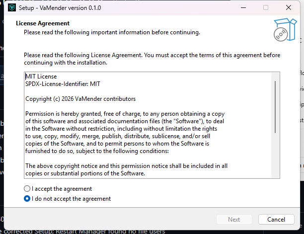
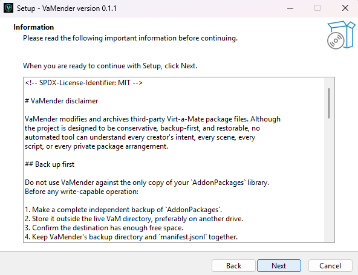
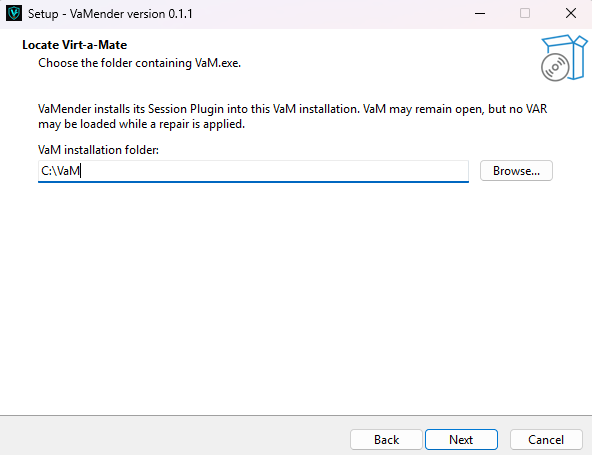
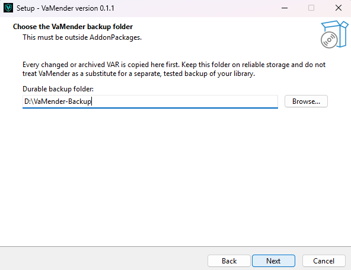
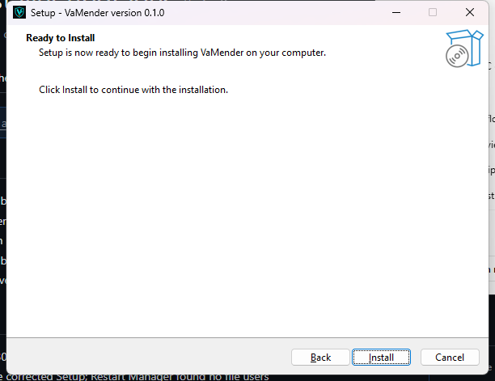
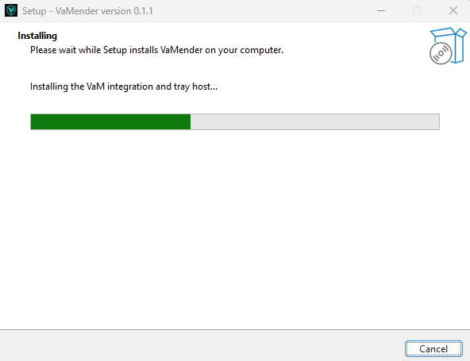
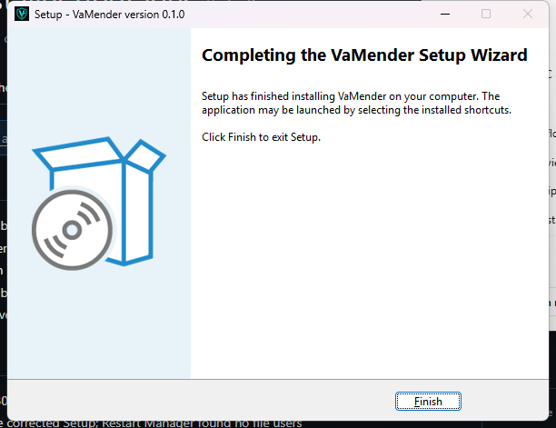
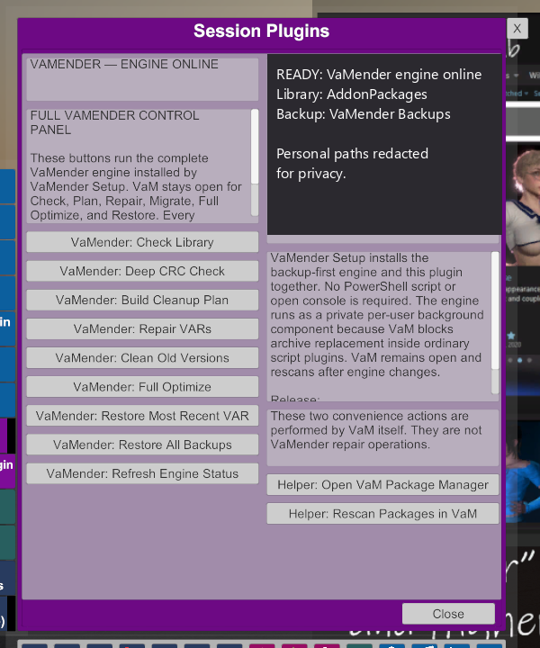

<!-- SPDX-License-Identifier: MIT -->

# Install VaMender on Windows

Use the project-published Setup executable unless you are developing VaMender.
Keep a separate, tested backup of `AddonPackages` before installing or applying
any cleanup operation.

## 1. Accept the software license

Read the license, select **I accept the agreement**, and choose **Next**.

## 2. Read the backup and data-loss warning

Do not continue if the live `AddonPackages` folder is your only copy. The
VaMender operation backup is an additional recovery layer, not a replacement
for a complete independent backup.

## 3. Select the Virt-a-Mate folder

Choose the folder that directly contains `VaM.exe` and `AddonPackages`. VaM may
remain open during installation, but do not load a VAR while a repair is being
applied.

## 4. Select a durable backup folder

Choose reliable storage outside `AddonPackages`. VaMender rejects the live
package folder and any backup folder nested inside it.

## 5. Review and start installation

Choose **Install** only after verifying both locations. During an upgrade, Setup
refuses to continue while VaMender has active or queued work. When the engine is
idle, Setup stops the tray host before replacing files, installs the new engine
and Session Plugin, and restarts one tray host automatically.

## 6. Wait for installation to finish

Do not interrupt Setup. Existing VaMender plugin revisions are copied to the
configured backup before an older revision is removed. The newly installed
plugin is checksum-verified first.

## 7. Finish and verify

Choose **Finish**. Confirm the VaMender shield appears in the Windows
notification area. Then open VaM, rescan packages, add VaMender under **Session
Plugins**, and confirm its status says **VAMENDER — ENGINE ONLINE**.

Right-click the notification-area icon to confirm the engine is ready and to
open reports, backups, About, startup settings, or the safe Exit command.

In VaM, choose **Open VaMender** and confirm the native Session Plugin control
panel reports that the engine is online.

Personal filesystem paths are explicitly redacted in the control-panel image.

The screenshots show a development build; the version in the title bar may be
newer in the published installer.
