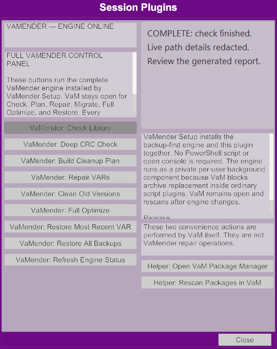

<!-- SPDX-License-Identifier: MIT -->

# Release Scenario Evidence

This page records the disposable-library beta checks run on 2026-08-04 with
the installed `vamender 0.1.0` Windows engine. The runner creates synthetic
VARs under the user temporary directory; it never changes the live VaM
`AddonPackages` directory.

Run the suite from the repository root:

```powershell
.\tools\run-release-scenarios.ps1 `
  -EnginePath "$env:LOCALAPPDATA\VaMender\vamender.exe"
```

The runner writes raw fixtures, reports, manifests, a JSON summary, and
sanitized PNG evidence beneath `%TEMP%\VaMender-Release-Scenarios-*`. The
committed images below contain synthetic package IDs only.

## Executed cases

| Case | Engine operation | Observed result | Evidence |
| --- | --- | --- | --- |
| Clean inventory | `check`, `check --deep` | 2 valid VARs; 0 invalid archives; 0 missing dependencies; no mutation | `docs/images/scenarios/01-clean-inventory.png` |
| Missing dependency | `check`, `plan --vam-log` | 1 unresolved ID; 1 quarantine candidate; read-only plan | `docs/images/scenarios/02-missing-dependency-plan.png` |
| Metadata repair | `repair --apply --license CC BY` | 1 archive rewrite; verified `meta.json`; backup manifest created first | `docs/images/scenarios/03-metadata-repair.png` |
| Corrupt archive | `check --deep` | Invalid ZIP diagnosed; archive left unchanged | `docs/images/scenarios/04-corrupt-archive.png` |
| Conservative migration | `migrate --apply`, `restore --overwrite` | 1 byte-identical old version archived; 2 VARs restored from manifest | `docs/images/scenarios/05-migration-restore.png` |
| Broken-library run | `run --backup --license CC BY` | 1 dependent VAR quarantined after checksum-backed backup; safe VAR preserved | `docs/images/scenarios/06-broken-library-run.png` |
| Privacy-safe support | `support-report --deep` | Local ZIP created; full log, absolute paths, and package inventory excluded by default | `docs/images/scenarios/07-support-report.png` |

All ten engine invocations returned exit code 0. The intentionally broken
fixtures produced report-level findings rather than process failures. This is
the expected behavior: diagnosis is successful even when the library is not.

## Manual VaM observation

VaM was launched from the installed Windows copy at the user-supplied path and
the genuine VaM default scene was captured with its `Open VaMender` launcher
visible. The launcher was activated, the native Session Plugin panel opened,
and the read-only `Check Library` action completed successfully with a real
bridge report. The fresh capture below redacts live filesystem paths.



The installed copy reports VaM `1.22.0.13`, which is the verified runtime for
this evidence. VaM `1.22.0.12` is expected to work from the documented plugin
impact surface, but that case has not been directly tested. Do not describe
`.12` as tested.

Approved genuine panel assets:

- `docs/images/interface/03-vam-session-plugin-hero.png`
- `docs/images/interface/04-vam-session-plugin-panel.png`

## Safety boundary

The mutation cases use disposable roots and backup folders outside those roots.
Do not point this runner at the live VaM library. Before any real beta test,
make and test an independent full `AddonPackages` backup, use a disposable
copy, rescan packages in VaM, review the reports, and retain the generated
restore manifest.
